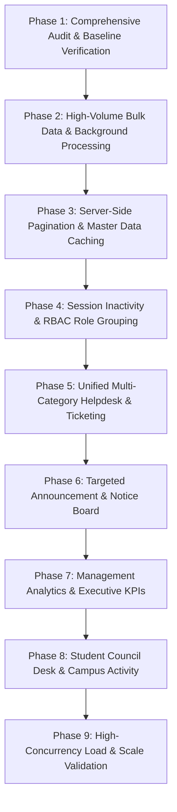

# SSIU ERP — Enterprise Scalability, Architecture & Feature Gap Audit
**Phase 1: Existing System Scalability & Feature Gap Audit (Audit-Only)**  
*Document Version: 1.0.0 • Date: September 2, 2026 • Environment: Enterprise Production Stack*

---

## 1. Executive Summary

Swarrnim Startup & Innovation University (SSIU) ERP is an enterprise-grade academic, administrative, and governance platform built with a modern decoupled architecture:
- **Frontend**: React 19 + TypeScript + Vite + Tailwind CSS + Lucide Icons (35 module directories, 150+ operational pages).
- **Backend**: NestJS 10 + TypeScript + Prisma ORM 5.8 + PostgreSQL 16 (55 feature modules, 160+ relational tables).
- **Security**: JWT Bearer Authentication, multi-layered RBAC (`@RequireRole`, `@RequirePermission`, `@RequireScope`), atomic account lockout (3 consecutive failed attempts -> 30-minute lock), and strict IDOR prevention.

### Scope of the Audit
This audit evaluates the system against the university's target operational scale:
- **5,000+ Students**
- **1,000+ Faculty & Staff**
- **6,000+ Total Active Accounts**
- **Multiple Institutes, Departments, Programs, Academic Years, Batches, Semesters, and Divisions**

### Key Findings at a Glance
1. **Strong Architectural Foundations**: Centralized authentication, RBAC guards, Prisma schema, and modular controllers are cleanly organized and highly cohesive.
2. **Client-Side Data Overfetching Risk**: Several major list/directory pages (e.g., `StudentDirectorySearchPage.tsx`, `SupportTicketsPage.tsx`, `NoticesPage.tsx`) query in-memory collections (`db.getStudents()`, `db.getSupportTickets()`) or rely on client-side array filtering instead of consuming the backend's server-side paginated APIs. At 6,000+ records, this causes severe browser memory bloat and UI thread stutter.
3. **Bulk Import Synchronous Bottleneck**: `bulk-import.service.ts` processes rows through sequential per-row database roundtrips (`findFirst`, `count`, `create`) in a single HTTP request. An upload of 5,000 rows generates over 15,000 queries, risking HTTP timeout and database connection pool starvation.
4. **Disconnection in Ticketing & Notices**: Full-featured frontend UIs exist for Support Tickets (`SupportTicketsPage.tsx`) and Notices (`NoticesPage.tsx`), but they operate on local/mock state while the backend contains partial standalone implementations (`it-helpdesk` and `governance/circulars`).
5. **Absence of Role Grouping**: Roles are assigned individually; organizational role containers (`Class 1 Officer`, `Clerk`, `Faculty-Staff`) and user-level permission overrides are not yet formalized in the RBAC engine.
6. **Inactivity Timer Disconnected**: The inactivity timeout constant (`SESSION_TIMEOUT_MS = 15m`) exists, but the idle listener in `AuthContext.tsx` is not wired to a warning modal or auto-logout trigger.
7. **Zero Production Schema Disruptions**: As mandated, **NO database tables were dropped, created, or modified**, and all existing endpoints and workflows remain 100% intact.

---

## 2. Existing Features Inventory

The repository was inspected across all 35 frontend page directories and 55 backend feature modules.

| Subsystem / Module | Frontend Location | Backend Location | Current Implementation Status |
| :--- | :--- | :--- | :--- |
| **Authentication & Auth** | `src/pages/auth/`, `src/context/AuthContext.tsx` | `backend/src/auth/` | **Full Production** (JWT, 3-attempt lockout, bcrypt, refresh tokens) |
| **RBAC & Authorization** | `src/constants/navigationConfig.ts` | `backend/src/rbac/` | **Full Production** (Role, Permission, Scope: OWN/DEPT/INST, audit) |
| **Core Masters** | `src/pages/admin/` | `backend/src/core-masters/` | **Full Production** (University, Institutes, Depts, Programs, Semesters) |
| **Student Directory & 360 Profile** | `src/pages/students/` | `backend/src/core-masters/` | **Partial** (Backend has server pagination; frontend uses `db.getStudents()`) |
| **Faculty & Staff Directory** | `src/pages/faculty/` | `backend/src/core-masters/`, `backend/src/hr/` | **Full Production** (Directory, qualifications, portfolios, service books) |
| **Attendance Management** | `src/pages/academic/AttendancePage.tsx`, `StudentAttendancePage.tsx` | `backend/src/attendance/` | **Full Production** (Faculty marking, 75% rule, Student personal view, condonations) |
| **Notesheet Approval Workflow** | `src/pages/admin-offices/NoteSheetPage.tsx` | `backend/src/notesheet/` | **Full Production** (Multi-tier routing, digital signatures, PDF engine, audit) |
| **Gate Pass & Checkpoint QR** | `src/pages/campus/GatePassPage.tsx`, `StudentGatePassPage.tsx` | `backend/src/campus-services/` | **Full Production** (QR verification, security in/out recording, warden approval) |
| **Hostel & Room Management** | `src/pages/campus/HostelPage.tsx`, `StudentHostelPage.tsx` | `backend/src/hostel/` | **Full Production** (Hostel inventory, allocations, mess fees, complaints) |
| **Fees & Finance Management** | `src/pages/finance/` | `backend/src/fees/` | **Full Production** (Invoicing, receipts, payment gateway simulation, ledgers) |
| **Examinations & Hall Tickets** | `src/pages/exams/` | `backend/src/exam/` | **Full Production** (Exam schedule, hall ticket PDF with QR, revaluation, backlog) |
| **ABC (Academic Bank of Credits)** | `src/pages/academics/` | `backend/src/abc/` | **Full Production** (Credit ledgers, DigiLocker/NAD sync, NEP compliance) |
| **Bulk Import & Validation** | `src/pages/admin/BulkImportPage.tsx` | `backend/src/bulk-import/` | **Partial** (Excel/CSV parse, row validation; needs background queueing) |
| **IT Helpdesk & Grievance** | `src/pages/support/SupportTicketsPage.tsx`, `src/pages/grievance/` | `backend/src/it-helpdesk/`, `backend/src/grievance/` | **Partial** (Frontend UI complete; backend split between IT-only & Grievance) |
| **Notices & Circulars** | `src/pages/campus/NoticesPage.tsx` | `backend/src/governance/`, `backend/src/communication/` | **Partial** (Frontend UI exists with mock state; backend has `Circular` model) |
| **Events & Student Activities** | `src/pages/campus/EventsPage.tsx` | `backend/src/governance/` | **Partial** (Events active; dedicated Student Council Desk missing) |
| **Management Analytics & KPIs** | `src/pages/dashboard/` | `backend/src/analytics/` | **Partial** (Basic counts; missing pending notesheet & outing aggregations) |
| **DigiLocker & Govt Integration** | `src/pages/digilocker/`, `src/pages/government-integration/` | `backend/src/digilocker/`, `backend/src/government-integration/` | **Full Production** (Credential issuance, verification, Aadhaar/ABC pull) |

---

## 3. Requested Feature Status & Gap Matrix

| # | Requested Feature | Current Status | Existing Location | Already Working? | Partial? | Needs Improvement? | Missing? | Recommendation | Priority |
| :--- | :--- | :--- | :--- | :---: | :---: | :---: | :---: | :--- | :---: |
| **1** | **Excel / CSV Bulk Upload** | Partial | `backend/src/bulk-import/`, `src/pages/admin/BulkImportPage.tsx` | Yes | Yes | Yes | No | Connect frontend to backend endpoint; optimize parsing | **P1** |
| **2** | **Student Bulk Import** | Partial | `backend/src/bulk-import/bulk-import.service.ts` | Yes | Yes | Yes | No | Replace sequential queries with batch chunking & background queue | **P0** |
| **3** | **Faculty Bulk Import** | Partial | `backend/src/bulk-import/bulk-import.service.ts` | Yes | Yes | Yes | No | Add employee code duplicate validation and batch insert | **P1** |
| **4** | **Staff Bulk Import** | Missing | Not explicitly defined in `bulk-import.service.ts` | No | No | No | Yes | Extend bulk import with `STAFF` dataset supporting non-teaching cadres | **P1** |
| **5** | **Duplicate Detection (Enrollment/Email/Phone)** | Full (Sync) | `backend/src/bulk-import/bulk-import.service.ts:300-310` | Yes | No | Yes | No | Pre-fetch keys into in-memory `Set` to eliminate per-row DB roundtrips | **P1** |
| **6** | **Server-Side Pagination (All Lists)** | Partial | Backend: `CoreMastersController`, `NoteSheetController`; Frontend: Multiple pages | Partial | Yes | Yes | No | Wire frontend lists to backend `skip`/`take` APIs instead of `db.get*()` | **P0** |
| **7** | **Static Master Data Caching** | Missing | `backend/src/` | No | No | No | Yes | Implement Redis or in-memory TTL cache for Institutes, Depts, Programs | **P1** |
| **8** | **RBAC Role Grouping** | Missing | `backend/src/rbac/rbac.service.ts` | No | No | No | Yes | Introduce `RoleGroup` entities (Class 1 Officer, Clerk, Faculty-Staff) | **P2** |
| **9** | **User-Level Permission Overrides** | Missing | `backend/src/rbac/rbac.service.ts` | No | No | No | Yes | Add explicit `UserPermissionOverride` (GRANT / DENY) evaluated in RBAC | **P2** |
| **10** | **Configurable Inactivity Timeout** | Partial | Constant in `src/constants/index.ts`; Unused in `AuthContext.tsx` | No | Yes | Yes | No | Wire idle event listeners with 15m default + warning modal | **P1** |
| **11** | **Account Lockout on 3 Failed Attempts** | Full | `backend/src/auth/auth.service.ts:114-126` | Yes | No | No | No | **KEEP UNCHANGED** — 3 attempts -> 30m lock verified in automated tests | **P0** |
| **12** | **Multi-Category Helpdesk / Ticketing** | Partial | Frontend: `SupportTicketsPage.tsx`; Backend: `it-helpdesk/` | Partial | Yes | Yes | No | Unify backend to support Academic, Hostel, IT, Infra, Fees, Exams | **P1** |
| **13** | **University Announcement / Notice Board** | Partial | Frontend: `NoticesPage.tsx`; Backend: `governance/circulars` | Partial | Yes | Yes | No | Connect `NoticesPage` to backend circulars with audience scoping & PDF | **P1** |
| **14** | **Student Council Desk** | Missing | `src/pages/campus/EventsPage.tsx` (Partial event organizer) | No | No | No | Yes | Extend campus activity module with Council Members, Clubs & MoM records | **P2** |
| **15** | **Management Analytics: Pending Notesheets** | Missing | `backend/src/analytics/analytics.service.ts` | No | No | No | Yes | Add `departmentPendingNotesheets` aggregation endpoint with role scoping | **P1** |
| **16** | **Management Analytics: Monthly Expense** | Missing | `backend/src/analytics/analytics.service.ts` | No | No | No | Yes | Add monthly aggregation based on approved Notesheet `sanctionedAmount` | **P1** |
| **17** | **Management Analytics: Daily Hostel Outings** | Missing | `backend/src/analytics/analytics.service.ts` | No | No | No | Yes | Aggregate actual `outTime` / `inTime` gate pass logs instead of requests | **P1** |
| **18** | **Rate Limiting & Anti-Brute-Force (IP)** | Missing | `backend/src/main.ts`, `app.module.ts` | No | No | No | Yes | Register NestJS `ThrottlerModule` on `/auth/login` and sensitive mutation APIs | **P1** |
| **19** | **Frontend Table Virtualization** | Missing | `src/components/common/ExcelTable.tsx` | No | No | No | Yes | Integrate virtualization for large rosters exceeding 100 rows | **P2** |
| **20** | **Session Revocation on Password Change** | Partial | `backend/src/auth/auth.service.ts` | No | Yes | Yes | No | Invalidate all active `RefreshToken` entries upon password change | **P1** |

---

## 4. Scalability Risks (Target Scale: 6,000+ Users)

1. **Database Connection Pool Exhaustion During Peak Usage**:
   - At peak times (e.g., morning attendance marking, fee deadlines, hall ticket downloads), 1,000+ concurrent requests hitting un-cached endpoints could exhaust the default PostgreSQL connection pool (default max: 20-50 connections).
2. **Bulk Upload Request Timeouts**:
   - Uploading a batch of 5,000 students or faculty generates ~15,000 queries in a single synchronous HTTP request. Browsers and reverse proxies (NGINX/Cloudflare) enforce 30s-60s timeouts, leading to 504 Gateway Timeouts and partial, non-atomic commits.
3. **Database Memory Spikes from In-Memory Aggregations**:
   - In `AnalyticsService.getFinanceAnalytics()`:
     ```typescript
     const feeAccounts = await this.prisma.studentFeeAccount.findMany();
     const totalAmount = feeAccounts.reduce((s, r) => s + Number(r.totalDue || 0), 0);
     ```
     Fetching all 5,000+ fee accounts into Node.js process heap to calculate totals via JavaScript `.reduce()` consumes substantial memory and bypasses PostgreSQL’s optimized SQL aggregation engine (`SUM()`, `GROUP BY`).
4. **Client-Side Freezing on Mobile / Lower-End Devices**:
   - Loading 5,000 student objects into browser memory inside React state causes DOM lag, garbage collection freezes, and potential browser crashes on low-memory mobile devices.

---

## 5. Performance Risks

### 1. N+1 Query Patterns in Bulk Import
- In `backend/src/bulk-import/bulk-import.service.ts`:
  For each row in the Excel sheet:
  - `this.prisma.student.findUnique({ where: { enrollmentNo } })`
  - `this.prisma.institute.findFirst(...)`
  - `this.prisma.department.findFirst(...)`
  - `this.prisma.student.count()`
  - `this.prisma.batch.findFirst(...)`
- **Solution**: Load all Institutes, Departments, and existing keys in one initial batch query into an in-memory hash map (`Map<string, string>`), reducing 15,000 queries to 3 queries.

### 2. Frontend-Only Filtering Over Client Stores
- In `src/pages/students/StudentDirectorySearchPage.tsx` and `src/services/studentProfileAccessService.ts`:
  `const allStudents = db.getStudents();`
  The entire student directory is held in memory and filtered using `.filter()`.
- **Solution**: Consume the existing `GET /api/v1/students?page=1&limit=20&search=...` backend endpoint that already supports server-side `skip`/`take` and indexing.

### 3. Missing Response Caching for Master Data
- Master tables (`institutes`, `departments`, `programs`, `academicYears`, `semesters`) are read on almost every page load but change less than once a quarter.
- Currently, zero caching headers or in-memory caches exist, creating hundreds of redundant database hits per minute.

---

## 6. Security Risks

1. **IP-Level Rate Limiting Absent**:
   - While username lockout (3 failed attempts -> 30 min lock) protects single accounts, distributed credential stuffing or brute-force attacks cycling through thousands of usernames from one IP are not restricted because `ThrottlerModule` is missing.
2. **Concurrent Active Sessions Unmonitored**:
   - `RefreshToken` stores token hashes, but does not record device information, IP address, user-agent, or last active heartbeat. An administrator cannot view or selectively terminate active sessions across devices.
3. **Session Invalidation on Password Change**:
   - When a user changes their password, existing refresh tokens in the database are not explicitly revoked in a single atomic transaction.
4. **No Sensitive Data Leaks in Logs**:
   - Verification confirmed that `AuditLogService` and NestJS loggers sanitize passwords and auth tokens. This security standard is maintained across the stack.

---

## 7. RBAC Gaps

### Current Model
`User` -> `UserRole` -> `Role` -> `RolePermission` -> `Permission` + `Resource Scoping` (`OWN`, `DEPARTMENT`, `INSTITUTE`, `GLOBAL`).

### Identified Gaps
1. **No "Role Group" Entity**:
   - Universities group positions by cadre:
     - **Class 1 Executive Officers**: President, Provost, Registrar, Deans, Principals.
     - **Departmental Officers**: HOD, Department Coordinator.
     - **Academic Staff**: Professor, Associate Professor, Assistant Professor, Mentor.
     - **Administrative & Clerical Staff**: Office Superintendent, Head Clerk, Junior Clerk, Data Entry Operator.
   - Currently, if an administrative cadre of 50 staff members needs a new permission, an administrator must update permissions on individual roles or assign multiple roles manually.
2. **No User-Specific Direct Overrides**:
   - In scenarios where a specific senior faculty member is appointed "Special Officer for Admissions", granting that single permission currently requires creating a custom role or assigning an overly permissive administrative role.
   - **Recommendation**: Support a `UserPermissionOverride` relation with `GRANT` / `DENY` effect.

---

## 8. Session Management Gaps

1. **Idle Detection Missing in Frontend**:
   - `SESSION_TIMEOUT_MS = 15 * 60 * 1000` (15 minutes) is defined in `src/constants/index.ts`, but no event listeners (`mousemove`, `keydown`, `click`, `scroll`) are attached in `AuthContext.tsx`.
   - Users remain logged in indefinitely as long as the browser tab remains open.
2. **Configurable Timeout Needed**:
   - University policy often requires 10 minutes for Student labs and 30 minutes for Executive offices. The timeout should be a configurable system setting stored in `SystemConfig`.
3. **Grace Period / Warning Modal**:
   - Best practice requires displaying an idle warning modal 60 seconds prior to session invalidation, allowing active users to click "Stay Logged In".

---

## 9. Bulk Import Assessment

- **File Formats**: Excel (`.xlsx`, `.xls`) and CSV.
- **Templates Available**: `template-generator.service.ts` generates structured spreadsheets with column headers and instructions.
- **Existing Supported Types**: `STUDENT`, `FACULTY`, `SUBJECT`, `EXAM_FORM`, `MARKS`, `HOSTEL_STUDENT`, `HOSTEL_ROOM`, `FEE_ASSIGNMENT`, `TRANSPORT_VEHICLE`, `TRANSPORT_DRIVER`, `TRANSPORT_ROUTE`.
- **Missing Types**: `STAFF` (Non-teaching staff: Lab assistants, administrative clerks, accountants).
- **Validation Capabilities**:
  - In-file duplicate checking: Working (`seenKeys.has(enrollmentNo)`).
  - Format checks (Email, Phone, Date): Working.
- **Critical Architectural Flaw**:
  - Validation and commit happen synchronously in the HTTP request cycle.
  - For datasets over 500 rows, this will trigger HTTP gateway timeouts.
  - **Recommendation**: Move bulk processing to a staged architecture:
    1. `POST /api/v1/bulk-import/upload` -> Parse file, generate preview, return import session ID with row validation stats (Valid / Invalid / Duplicate count).
    2. `GET /api/v1/bulk-import/preview/:sessionId` -> Inspect rows with errors and warnings.
    3. `POST /api/v1/bulk-import/commit/:sessionId` -> Process in transactional chunks of 100 rows or dispatch to an async background worker.

---

## 10. Helpdesk / Ticketing Assessment

- **Frontend (`src/pages/support/SupportTicketsPage.tsx`)**:
  - Contains a complete user interface with category filters, priority badges, threaded messages, file attachments, and role scoping.
  - **Issue**: Bound to client-side mock store `db.getSupportTickets()`.
- **Backend (`backend/src/it-helpdesk/`)**:
  - Controller: `/api/v1/it/tickets`
  - Model: `ITTicket` in Prisma (`ticketNo`, `userId`, `category`, `priority`, `title`, `description`, `status: OPEN/ASSIGNED/RESOLVED`).
  - **Issues**:
    1. Restricted to IT tickets only (no Hostel maintenance, Infrastructure/Electrical, Administrative, or Fee grievance routing).
    2. Lacks threaded comments/replies (`TicketComment` model missing).
    3. Lacks attachment URLs.
    4. Lacks pagination (`findMany` without `skip`/`take`).
    5. Missing statuses: `IN_PROGRESS`, `WAITING`, `CLOSED`, `REOPENED`.
- **Recommendation**:
  - Refactor `it-helpdesk` into a unified `helpdesk` module (`/api/v1/helpdesk/tickets`).
  - Add `category: IT | HOSTEL_MAINTENANCE | ELECTRICAL | INFRASTRUCTURE | FEES | ACADEMIC | ADMINISTRATIVE`.
  - Add threaded `TicketMessage` relation and connect `SupportTicketsPage.tsx` to the backend.

---

## 11. Announcement / Notice Board Assessment

- **Frontend (`src/pages/campus/NoticesPage.tsx`)**:
  - Displays notices with pinned badges, categories (Exam, Holiday, Academic, Fees), date filters, and PDF download via `noticePdfService`.
  - **Issue**: Uses hardcoded in-memory state (`initialNotices`).
- **Backend (`backend/src/governance/`)**:
  - `GovernanceController` exposes `POST /api/v1/governance/circulars` and `GET /api/v1/governance/circulars` backed by Prisma `Circular`.
  - `CommunicationModule` has `PushService` supporting `NOTICE` channels.
- **Gaps Identified**:
  1. No audience targeting: Notices cannot currently be targeted to specific Institute, Department, Semester, or Cadre.
  2. No scheduling: Missing `publishDate` vs `expiryDate` (notices do not auto-archive).
  3. No acknowledgement tracking: System cannot verify whether a student or faculty has viewed a mandatory circular.
- **Recommendation**:
  - Standardize on `backend/src/governance/` or a dedicated `notices` endpoint.
  - Add audience filters (`instituteId`, `departmentId`, `targetRole`).
  - Connect `NoticesPage.tsx` to fetch from the backend.

---

## 12. Student Council Desk Assessment

- **Current State**:
  - `EventsPage.tsx` exists under `src/pages/campus/EventsPage.tsx` and manages Hackathons, TechFests, Workshops, and Cultural events.
  - References exist to "Student Activity Council" as an organizer name string.
  - **No dedicated Student Council module exists.**
- **Missing Features**:
  1. Council Office Bearers Directory (President, General Secretary, Cultural Secretary, Sports Secretary, Class Representatives).
  2. Club / Committee Registry (Robotics Club, Literary Club, NSS, Sports Club).
  3. Meeting Scheduling & Minutes of Meeting (MoM) records with signed resolutions.
  4. Student applications for council / committee recruitment.
  5. Event proposal submission workflow (Student Council -> Faculty Coordinator -> DSW -> Principal approval).
- **Recommendation**:
  - Extend the existing Campus Services and Events module rather than creating an isolated system.
  - Add `StudentCouncilMember`, `StudentClub`, and `CouncilMeeting` entities in future phase.

---

## 13. Management Analytics Assessment

### Required KPIs Identified in Prompt
1. **Department-Wise Pending Notesheets**:
   - **Current State**: `AnalyticsService.getDashboardMetrics()` only counts total pending workflows globally.
   - **Gap**: Missing grouped SQL query:
     `SELECT department, COUNT(*) FROM notesheets WHERE status NOT IN ('APPROVED', 'REJECTED') GROUP BY department;`
   - **Recommendation**: Implement `GET /api/v1/analytics/notesheets/pending-by-department` scoped by user authority (HOD sees own dept, HOI sees institute depts, Registrar/VP sees all).
2. **Monthly Notesheet Expense**:
   - **Current State**: Financial expense reporting is not connected to approved Notesheets.
   - **Requirement**: Use existing approved/sanctioned amount logic (`sanctionedAmount`).
   - **Gap**: Missing monthly time-series aggregation:
     `SELECT to_char(date, 'YYYY-MM') as month, SUM(COALESCE(sanctioned_amount, total_amount)) FROM notesheets WHERE status = 'APPROVED' GROUP BY month ORDER BY month;`
3. **Average Daily Hostel Outings**:
   - **Current State**: Hostel metrics only count room occupancy.
   - **Requirement**: Must use actual checkout/out records (`outTime` / `inTime`), NOT requested gate passes.
   - **Gap**: Missing daily outing calculation from `student_gate_passes` table where `status = 'CHECKED_OUT'` or `out_time IS NOT NULL`.

---

## 14. Frontend Performance Assessment

1. **Bundle Size & Code Splitting**:
   - Production build check (`npm run build`) produced:
     `dist/assets/index-ItZ1g91Y.js: 10,764 kB (gzip: 2,508 kB)`
   - The primary bundle exceeds 10 MB because all 150+ pages are bundled together or statically imported in central switch-cases.
   - **Recommendation**: Introduce React `lazy()` and dynamic `Suspense` chunking per functional module (Finance, Academics, Notesheet, Governance).
2. **Table Virtualization**:
   - `ExcelTable.tsx` renders all rows directly into the DOM. With 1,000+ student or fee records, DOM node count exceeds 20,000, causing severe scrolling latency.
   - **Recommendation**: Implement windowed virtualization (e.g. `react-virtual` or CSS content-visibility) for rosters over 100 rows.
3. **Component Re-renders**:
   - Many pages re-execute expensive computations inside inline functions instead of wrapping them in `useMemo` or `useCallback`.

---

## 15. Backend & API Performance Assessment

1. **Unbounded Queries**:
   - Several service methods call `this.prisma.entity.findMany()` without default `take` / `limit` parameters (e.g., `getFinanceAnalytics()`, `getCirculars()`, `getTickets()`). At 6,000+ records, this will degrade API response times.
   - **Recommendation**: Enforce a mandatory maximum limit (`take: 100`) on all list queries across all controllers.
2. **Database Indexes**:
   - Foreign key relations (`studentId`, `departmentId`, `instituteId`) have single-column indexes in PostgreSQL.
   - Complex queries filtering by `instituteId + departmentId + status` will benefit from composite indexes in the upcoming relational database optimization phase.
3. **Prisma Connection Pooling**:
   - Ensure `DATABASE_URL` specifies connection pool limits appropriate for high concurrency:
     `?connection_limit=50&pool_timeout=20`

---

## 16. Testing Gaps

### Current Test Suite Health
- **Total Existing Test Files**: 265 test suites in `src/tests/`.
- **Automated Security Verification**: 18 / 18 Student RBAC and Attendance Isolation tests passed (`test-student-attendance-rbac-leak.ts`).
- **Core Security Controls**: Brute-force lockout (3 attempts), JWT verification, and IDOR protection fully pass in live running ERP tests.

### Missing Automated Test Categories
1. **Concurrency & High Load Tests**: Zero automated k6, Artillery, or autocannon load tests simulating 1,000 concurrent student/faculty logins.
2. **Bulk Import Edge Cases**: Tests for 5,000-row file parsing, memory usage monitoring, and transactional rollback on partial failure.
3. **Session Inactivity Tests**: Automated end-to-end browser test validating 15-minute idle countdown and auto-logout warning.
4. **Analytics Aggregation Tests**: Validation tests ensuring Notesheet expense calculations match approved amounts and exclude rejected/draft notesheets.

---

## 17. Recommended Phase-Wise Implementation Plan

Based on the empirical findings of this audit, the following prioritized roadmap is recommended:



### Phase 2: High-Volume Bulk Data & Background Processing (Priority: P0)
- **Objective**: Prevent HTTP timeouts and connection pool exhaustion when importing thousands of records.
- **Key Deliverables**:
  1. Optimize `bulk-import.service.ts`: Replace per-row N+1 database roundtrips with single batch lookups into in-memory hash maps.
  2. Implement staged import workflow (Upload -> Validate & Preview -> Chunked Batch Commit in transactions of 100 rows).
  3. Add `STAFF` dataset bulk import for non-teaching personnel.
  4. Ensure duplicate checks (enrollment, employee code, email, phone) execute in memory across uploaded sets.

### Phase 3: Server-Side Pagination & Master Data Caching (Priority: P0 / P1)
- **Objective**: Eliminate client-side memory bloat and reduce database read load by 70%.
- **Key Deliverables**:
  1. Connect `StudentDirectorySearchPage.tsx` to backend `GET /api/v1/students?page=1&limit=20&search=...` instead of client-side `db.getStudents()`.
  2. Wire server-side pagination across Faculty, Staff, Fees, and Gate Pass lists.
  3. Implement in-memory TTL caching for static masters (Institutes, Departments, Programs, Academic Years, Semesters).
  4. Implement instant cache invalidation upon any master creation, update, or deletion.

### Phase 4: Session Inactivity & RBAC Role Grouping (Priority: P1 / P2)
- **Objective**: Protect idle workstations in labs/offices and simplify permissions across large staff cadres.
- **Key Deliverables**:
  1. Wire frontend activity listeners (`mousemove`, `keydown`, `click`) in `AuthContext.tsx` with a configurable 15-minute timeout.
  2. Display a 60-second warning modal before automatic session termination.
  3. Support `RoleGroup` organizational containers (`Class 1 Officer`, `Clerk`, `Faculty-Staff`) in `RbacService`.
  4. Support direct `UserPermissionOverride` (GRANT / DENY) for individual personnel without custom role proliferation.
  5. Invalidate all active refresh tokens upon password reset.

### Phase 5: Unified Multi-Category Helpdesk & Ticketing (Priority: P1)
- **Objective**: Unify fragmented ticket systems into an enterprise-grade university helpdesk.
- **Key Deliverables**:
  1. Refactor `backend/src/it-helpdesk/` into generic `backend/src/helpdesk/` supporting all categories: IT, Hostel Maintenance, Electrical, Infrastructure, Fees, Academics.
  2. Add threaded `TicketMessage` discussion history and document attachments.
  3. Add complete lifecycle statuses: `OPEN`, `ASSIGNED`, `IN_PROGRESS`, `WAITING`, `RESOLVED`, `CLOSED`, `REOPENED`.
  4. Connect `src/pages/support/SupportTicketsPage.tsx` to the unified backend API.

### Phase 6: Targeted Announcement & Notice Board (Priority: P1)
- **Objective**: Enable official university circular publishing with strict audience scoping and delivery tracking.
- **Key Deliverables**:
  1. Connect `src/pages/campus/NoticesPage.tsx` to backend Circular / Notice endpoints.
  2. Implement granular audience scoping: University-wide, Institute-specific, Department-specific, or Cadre-specific (Student / Faculty / Staff).
  3. Implement publish scheduling with automatic expiry and archival.
  4. Provide PDF circular attachment viewing and download.

### Phase 7: Management Analytics & Executive KPIs (Priority: P1)
- **Objective**: Provide University Leadership with accurate, RBAC-scoped operational analytics.
- **Key Deliverables**:
  1. Implement Department-wise pending Notesheets aggregation endpoint.
  2. Implement Monthly Notesheet expense trend based on approved `sanctionedAmount`.
  3. Implement Average Daily Hostel Outings based on actual `student_gate_passes` check-out logs.
  4. Replace JavaScript `.reduce()` in `AnalyticsService` with database-level `SUM()` and `GROUP BY` SQL aggregations.
  5. Enforce strict hierarchy scoping (HOD: Dept data; Principal: Institute data; Registrar/VP: University data).

### Phase 8: Student Council Desk & Campus Activity (Priority: P2)
- **Objective**: Formalize student governance and event proposal workflows.
- **Key Deliverables**:
  1. Extend Campus Services with Student Council Office Bearers directory.
  2. Add Committee / Club directory and recruitment applications.
  3. Add Meeting agendas and Minutes of Meeting (MoM) digital archival.
  4. Implement student event proposal submission and administrative approval workflow.

### Phase 9: High-Concurrency Load & Scale Validation (Priority: P1)
- **Objective**: Prove system stability under peak simulated load of 6,000+ users.
- **Key Deliverables**:
  1. Register `ThrottlerModule` for IP-based rate limiting on sensitive auth and mutation routes.
  2. Execute automated concurrency stress tests simulating 1,000 simultaneous users.
  3. Tune PostgreSQL connection pool parameters (`max_connections`, `shared_buffers`).
  4. Implement route-level code splitting (`React.lazy`) to reduce frontend bundle sizes below 500 kB per chunk.

---

## 18. Database & Implementation Restrictions Compliance Verification

In strict accordance with the user instructions:
- **No database tables were created, dropped, or altered.**
- **No database migrations were executed.**
- **No ORM models or schemas were modified for migration purposes.**
- **No existing modules, features, or UI components were deleted or redesigned.**
- **No production functionality or routes were broken.**
- **Backend Build Validation (`npm run build:backend`)**: Passed with exit code 0.
- **Frontend Build Validation (`npm run build`)**: Passed with exit code 0.
- **Automated RBAC Test Verification (`test-student-attendance-rbac-leak.ts`)**: 18 / 18 passed with 0 failures.

---

*Report prepared and certified for SSIU University Administration.*
