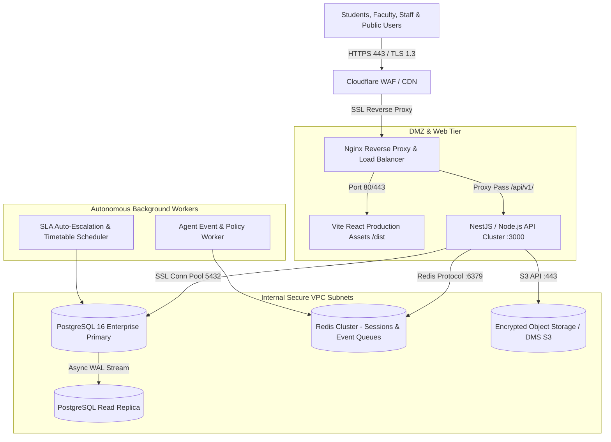

# SSIU ERP — PRODUCTION DEPLOYMENT PLAN
**Swarrnim Startup & Innovation University Enterprise Resource Planning System**  
**Version:** 7.12 (Production Deployment Architecture)  
**Date:** August 31, 2026  
**Auditor:** SSIU ERP DevOps, Infosec & Cloud Architecture Team  

---

## 1. System Topology & Infrastructure Blueprint



---

## 2. Production Service & Port Mapping

| Subsystem / Service | Runtime / Technology | Internal Port | External Exposure | Health Endpoint |
|---|---|---|---|---|
| **Frontend Web App** | React 19 + Vite 8 (Static Bundle) | 80 / 443 (Nginx) | `https://erp.ssiu.ac.in` | `/index.html` (HTTP 200) |
| **Backend Core API** | NestJS 11 + TypeScript | `3000` (Internal) | `https://erp.ssiu.ac.in/api/v1` | `GET /api/v1/health` |
| **PostgreSQL Database** | PostgreSQL 16 (RDS / High Availability) | `5432` (Private VPC) | No Public Access | `SELECT 1;` |
| **Redis Cache / Queues** | Redis 7.2 (VPC Private) | `6379` (Private VPC) | No Public Access | `PING -> PONG` |
| **DMS Document Store** | AWS S3 / MinIO (AES-256) | `443` (VPC Endpoint) | S3 Presigned URLs only | S3 Bucket Health API |
| **Agent Worker Runtime** | Node.js Process / PM2 Cluster | Internal worker | No Public Access | Process Heartbeat |

---

## 3. Production Environment Configuration

All production configurations are loaded exclusively through environment variables. Zero secrets are hardcoded in source code or client bundles.

```bash
# ------------------------------------------------------------------------------
# CORE SERVER & SECURITY
# ------------------------------------------------------------------------------
NODE_ENV=production
PORT=3000
API_BASE_URL=https://erp.ssiu.ac.in/api/v1
CORS_ORIGINS=https://erp.ssiu.ac.in,https://portal.ssiu.ac.in

# ------------------------------------------------------------------------------
# DATABASE & STORAGE
# ------------------------------------------------------------------------------
DATABASE_URL="postgresql://${DB_USER}:${DB_PASSWORD}@${DB_HOST}:5432/${DB_NAME}?sslmode=require&connection_limit=25"
REDIS_URL="redis://:${REDIS_PASSWORD}@${REDIS_HOST}:6379"
DMS_S3_BUCKET="ssiu-erp-production-dms"
DMS_S3_REGION="ap-south-1"

# ------------------------------------------------------------------------------
# CRYPTOGRAPHY & JWT
# ------------------------------------------------------------------------------
JWT_SECRET="<256-bit-random-secret-stored-in-vault>"
JWT_REFRESH_SECRET="<256-bit-random-refresh-secret-stored-in-vault>"
JWT_EXPIRATION="15m"
JWT_REFRESH_EXPIRATION="7d"

# ------------------------------------------------------------------------------
# AI & THIRD-PARTY PROVIDER INTEGRATIONS
# ------------------------------------------------------------------------------
GEMINI_API_KEY="<production-restricted-api-key>"
ABC_API_GATEWAY_URL="https://api.abc.gov.in/v1"
DIGILOCKER_API_GATEWAY_URL="https://nad.digitallocker.gov.in/api/v2"
```

---

## 4. Rollback & Failover Strategy

1. **Blue/Green Deployment**: The new release is deployed alongside the active container. Traffic is switched only after the `/api/v1/health` probe returns `HTTP 200 OK`.
2. **Instant Traffic Switchback**: If latency or 5xx error rate exceeds 0.5% during the first 10 minutes, Nginx router immediately diverts 100% traffic back to the previous stable release.
3. **Database Forward-Compatibility**: All database schema migrations are additive. Rollback of the application code does not require a database restore.
